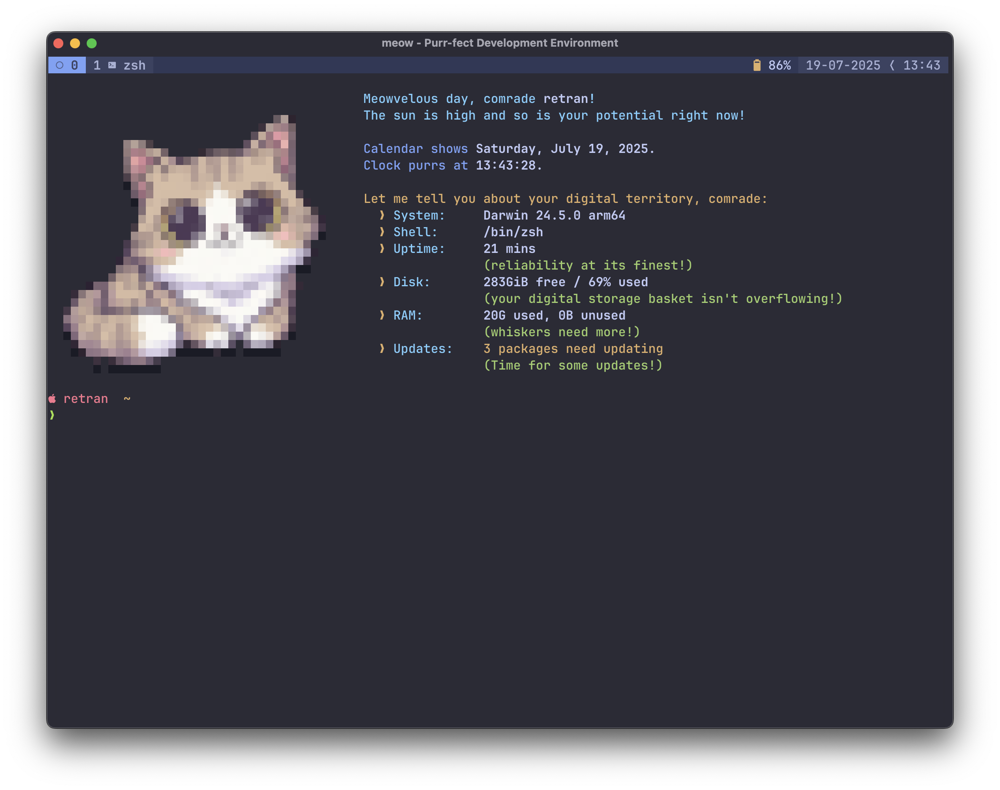
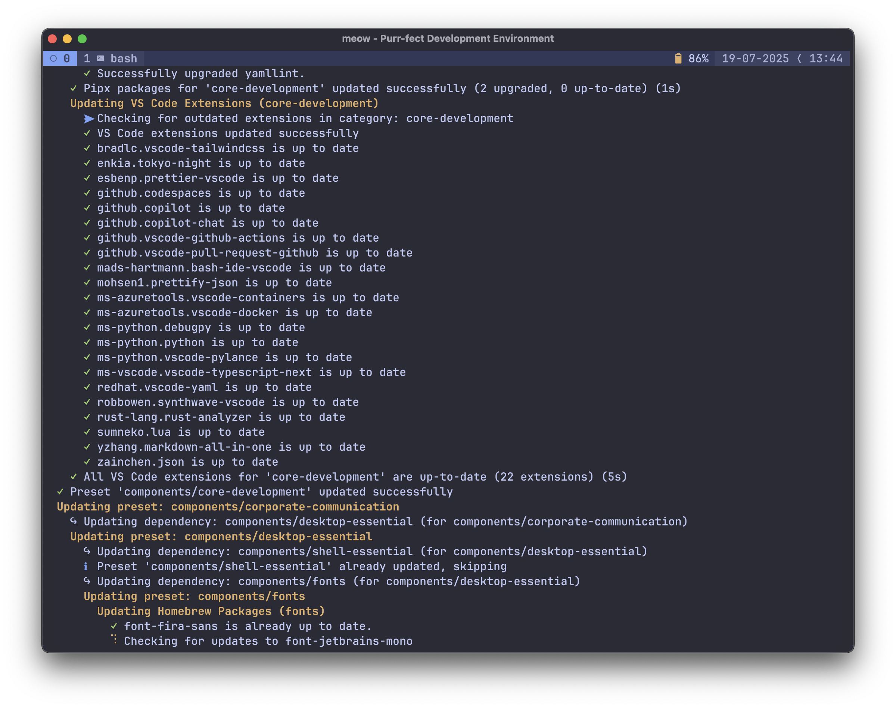
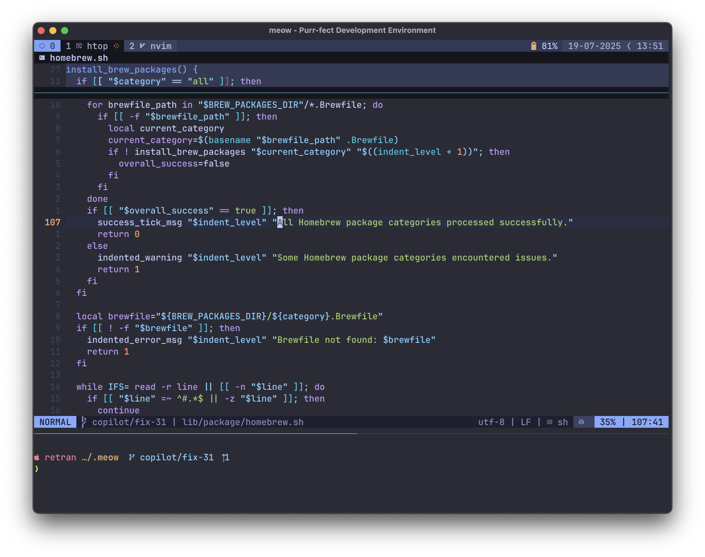

# 🐱 meow

> The purr-fect dotfiles management system that sets up your development environment with a single meow.

<div align="center">


</div>

<div align="center">

<br>
<strong>meow - Purr-fect Development Environment</strong>
</div>

A comprehensive dotfiles management system that automates the tedious task of configuring a new machine by applying predefined setups called "presets." Instead of spending hours installing packages and tweaking configs, just pick a preset and you're ready to code. Part of the `project meow` ecosystem, including [`Meowvim`](https://github.com/retran/meowvim) for Neovim configuration.

## 🖼️ Screenshots

<div align="center">







</div>

## 📋 Table of Contents

- [🖼️ Screenshots](#️-screenshots)
- [✨ Features](#-features)
- [📋 Prerequisites](#-prerequisites)
- [⚡ Quick Start](#-quick-start)
- [🧩 Components](#-components)
- [🔧 Troubleshooting](#-troubleshooting)
- [🤝 Contributing](#-contributing)
- [📄 License](#-license)
- [🙏 Acknowledgments](#-acknowledgments)

## ✨ Features

`meow` provides a comprehensive development environment setup with these key capabilities:

### 🎯 Preset System

- **Personal Preset**: Full development setup with all tools and customizations
- **Corporate Preset**: Work-focused Go development environment

### 🔧 Development Environments

- **Go Development**: Complete environment with language server, debugger, and tools
- **JavaScript/TypeScript**: Node.js tools, language servers, and formatters
- **Kotlin Development**: Kotlin environment and tooling
- **.NET Development**: .NET tools and SDK
- **React Development**: React-specific tooling extending JavaScript
- **Web Development**: CSS frameworks, build tools, and HTTP testing
- **Game Development**: Tools and engines including Godot
- **Markdown**: Technical writing with linting and presentation tools

### 🐾 User Experience

- **Automatic Configuration**: Seamless dotfile linking and setup
- **One-Command Installation**: Simple script-based deployment
- **Modular Components**: Mix and match for custom setups
- **Dependency Resolution**: Automatic component dependency management

## 📋 Prerequisites

Before installing `meow`, ensure you have the following:

### Required

- **Operating System**: macOS
- **Shell**: Bash 3.2+ (default on macOS)
- **Internet Connection**: For downloading packages and tools

### Bash Compatibility

`meow` is designed to work with the default bash 3.2 that ships with macOS, avoiding the chicken-and-egg problem where you need a newer bash to install a newer bash.

## 🚀 Quick Start

After installation, follow these steps to get started:

### 1. Choose Your Preset

Based on your needs:

- **New personal machine**: Use `personal` preset
- **Work environment**: Use `corporate` preset

### 2. One-Command Setup

```bash
# Personal environment
curl -fsSL https://github.com/retran/meow/archive/main.tar.gz | tar -xz -C ~ && mv ~/meow-main ~/.meow && cd ~/.meow && git submodule update --init --recursive && ./bin/install.sh personal

# Corporate environment
curl -fsSL https://github.com/retran/meow/archive/main.tar.gz | tar -xz -C ~ && mv ~/meow-main ~/.meow && cd ~/.meow && git submodule update --init --recursive && ./bin/install.sh corporate
```

### 3. Enjoy Your Setup

After installation:

- All development tools will be available
- Configurations are automatically linked

### 4. Keep It Updated

```bash
cd ~/.meow
./bin/update.sh
```

## 🧩 Components

`meow` uses a modular component system where each component can depend on others, creating a layered architecture for development environments:

### Foundation Components

- **🐚 shell-essential** - Essential shell tools (Git, Tmux, Starship, Neovim, fzf, ripgrep, zoxide, pyenv, pipx, pandoc)
- **🔧 shell-development** - Shell development tools (shellcheck, shfmt, bash-language-server, yamllint)
- **🐍 python-development** - Python development environment (Python extensions for VS Code)
- **🎨 fonts** - Programming fonts (JetBrains Mono, Nerd Fonts)
- **🖥️ desktop-essential** - GUI foundation for macOS (includes fonts, browser, terminal, VS Code)
- **🛠️ core-development** - Core development tools (GitHub CLI, language servers, formatters, go-task)

### Development Environments

- **🐹 go-development** - Complete Go environment (gopls, delve debugger, staticcheck, air, templ, swag)
- **⚡ javascript** - JavaScript/TypeScript development with Node.js ecosystem tools
- **⚛️ react** - React development framework extending JavaScript
- **🌐 web** - Advanced web development extending React with deployment and HTTP tools
- **🦀 rust-development** - Rust development tools and environment
- **🗾 kotlin-development** - Kotlin development environment
- **🦄 dotnet-development** - .NET development tools and SDK
- **🎮 game-development** - Game development tools and engines
- **📝 markdown** - Technical writing with linting, presentation tools, and rendering

### Communication & Productivity

- **💼 corporate-communication** - Professional communication tools
- **👥 personal-communication** - Personal messaging applications
- **📋 productivity** - Productivity applications and workflow tools

### Entertainment & Media

- **🎮 gaming** - Gaming platforms (Steam, NVIDIA GeForce Now)
- **🎨 media** - Media editing and graphics tools (FFmpeg, ImageMagick, OBS)

### Package Manager Support

Components support multiple package managers:

- **Homebrew** - macOS packages and applications
- **npm** - JavaScript/Node.js packages
- **pipx** - Python applications in isolated environments
- **go install** - Go tools and applications
- **cargo** - Rust tools and applications
- **Mac App Store (mas)** - macOS App Store applications
- **VS Code extensions** - Development environment extensions

Components automatically resolve dependencies - for example, `web` includes `react`, which includes `javascript`, which includes `core-development`, which includes `shell-essential`.

## 🔧 Troubleshooting

### Common Issues

#### Installation Fails

```bash
# Check if Git is installed
git --version

# Ensure submodules are properly initialized
cd ~/.meow
git submodule init
git submodule update --recursive

# Try installing again
./bin/install.sh PRESET_NAME
```

#### Package Manager Issues

```bash
# For Homebrew issues on macOS
/bin/bash -c "$(curl -fsSL https://raw.githubusercontent.com/Homebrew/install/HEAD/install.sh)"

# For npm issues
npm cache clean --force
npm install -g npm@latest

# For pipx issues
python -m pip install --upgrade pipx
pipx ensurepath
```

#### `Meowvim` Configuration Not Working

```bash
# Check if Meowvim submodule is properly initialized
cd ~/.meow
git submodule status

# If not initialized, run:
git submodule init
git submodule update

# Check Neovim installation
nvim --version
```

#### Permission Issues

```bash
# Fix ownership issues
sudo chown -R $(whoami) ~/.meow

# Fix script permissions
chmod +x ~/.meow/bin/*.sh
```

### Getting Help

- Check the [issues page](https://github.com/retran/meow/issues)
- Review preset configurations in `presets/` directory
- Examine component definitions in `presets/components/`
- Check package definitions in `packages/` directory

## 🤝 Contributing

Contributions are welcome to help improve `meow`! Here's how you can help:

### Ways to Contribute

- 🐛 Report bugs
- 💡 Suggest new features or presets
- 📝 Improve documentation
- 🔧 Submit code improvements
- 🎨 Enhance configurations
- 📦 Add new package integrations

## 📄 License

This project is licensed under the MIT License. See the [LICENSE](LICENSE) file for details.

## 🙏 Acknowledgments

`meow` builds on the excellent work of the open-source community and development tools:

- [Homebrew](https://brew.sh/) - macOS package manager
- [Git](https://git-scm.com/) - Version control system
- [GitHub CLI](https://cli.github.com/) - Git hosting command line interface
- [tmux](https://github.com/tmux/tmux) - Terminal multiplexer
- [Starship](https://starship.rs/) - Cross-shell prompt
- [zsh](https://zsh.sourceforge.io/) - Z shell
- [Neovim](https://neovim.io/) - Hyperextensible text editor
- [Visual Studio Code](https://code.visualstudio.com/) - Code editor
- [Ghostty](https://ghostty.org/) - Terminal emulator
- [fzf](https://github.com/junegunn/fzf) - Fuzzy finder
- [ripgrep](https://github.com/BurntSushi/ripgrep) - Text search tool
- [fd](https://github.com/sharkdp/fd) - File finder
- [eza](https://github.com/eza-community/eza) - Modern ls replacement
- [zoxide](https://github.com/ajeetdsouza/zoxide) - Smart directory navigation
- [jq](https://stedolan.github.io/jq/) - JSON processor
- [yq](https://github.com/mikefarah/yq/) - YAML processor
- [Go](https://golang.org/) - Programming language
- [Node.js](https://nodejs.org/) - JavaScript runtime
- [Rust](https://www.rust-lang.org/) - Systems programming language
- [TypeScript](https://www.typescriptlang.org/) - Typed JavaScript
- [Raycast](https://raycast.com/) - macOS productivity tool
- [Hammerspoon](https://www.hammerspoon.org/) - macOS automation
- [mas](https://github.com/mas-cli/mas) - Mac App Store CLI
- [JetBrains Mono](https://www.jetbrains.com/lp/mono/) - Developer typeface
- [Nerd Fonts](https://www.nerdfonts.com/) - Iconic font collection

and many other open-source projects that make development enjoyable

### Author

`meow` is developed by Andrew Vasilyev with help from GitHub Copilot and feline assistants Sonya Blade, Mila, and Marcus Fenix.

---

<div align="center">

**Happy coding with `project meow`! 🐱**

Made with ❤️ by Andrew Vasilyev and feline assistants

[Report Bug](https://github.com/retran/meow/issues) · [Request Feature](https://github.com/retran/meow/issues) · [Contribute](https://github.com/retran/meow/pulls)

</div>
