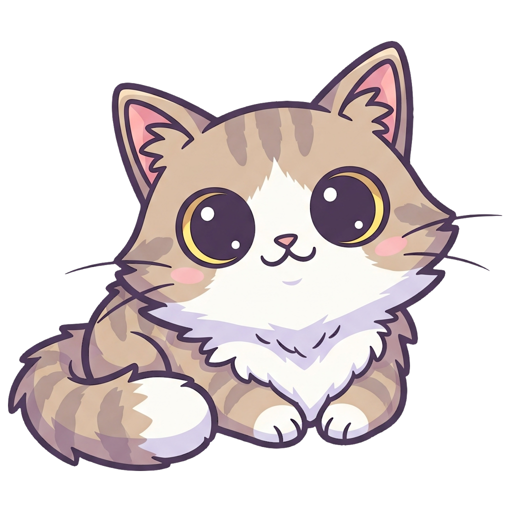

# 🐱 .meow

[](https://github.com/retran/meow/stargazers)
[](https://github.com/retran/meow/network/members)
[](./LICENSE)

<div align="center">

### The purr-fect configuration management framework for crafting reproducible developer environments across macOS and Linux.



[Full Documentation](./docs/README.md) • [Architecture](./docs/12-ARCHITECTURE.md) • [Installation](./docs/01-INSTALLATION.md) • [Component Guide](./docs/09-COMPONENT-DEVELOPMENT.md) • [Contributing](https://github.com/retran/meow/pulls)

</div>

## 🎯 Overview

Setting up a consistent and reproducible development environment is often a tedious, manual process prone to errors. `.meow` solves this by providing a **modular, declarative configuration management framework** that automates the setup of developer environments across diverse operating systems. It's more than just dotfiles; it's a powerful system for defining, installing, and managing your entire development stack with idempotent operations, ensuring your environment is always in the desired state.

### Who Should Use This?

`.meow` is built for professionals who value automation, reproducibility, and control over their development environments:

-   **Polyglot Developers** who work across multiple languages and frameworks and need consistent setups.
-   **DevOps Engineers** who provision and manage developer workstations or CI/CD environments.
-   **System Tweakers** who demand precise control and automation over their macOS and Linux systems.

## ✨ Key Features

-   **🧩 Component-Based Architecture**: Build your environment from isolated, reusable [components](./docs/09-COMPONENT-DEVELOPMENT.md), each defined by a clear manifest and containing its own packages, configurations, and scripts.
-   **📦 Universal Package Management**: Seamlessly handle package installations across macOS (Homebrew, mas) and Linux (apt, dnf, pacman, apk) through a unified abstraction layer.
-   **📑 Presets (Den & Litterbox)**: Apply configurations called [Presets](./docs/03-USING-PRESETS.md) to quickly deploy tailored setups.
-   **🔄 Idempotent Operations**: Run setup scripts multiple times safely; `.meow` ensures that actions are only taken if necessary, bringing your system to the desired state without unintended side effects, a core [principle](./docs/11-PRINCIPLES.md) of the framework.
-   **⚡ Zero Dependencies**: The core framework is written in pure Shell (Bash/Zsh) and requires only `git` and `curl` to bootstrap, ensuring maximum portability and minimal overhead. It is also compatible with Bash 3.2, which is the default on macOS.

## 📦 Installation

For detailed instructions, please see the [**Full Installation Guide**](./docs/01-INSTALLATION.md).

### Quick Install

```bash
git clone [https://github.com/retran/meow.git](https://github.com/retran/meow.git) ~/.meow
cd ~/.meow
````

## 🚀 Quick Start

### 1\. Configure Environment (Important\!)

Before installing a preset, set up your personal configuration. This ensures your Git identity and secrets are correctly linked.

```bash
# Global settings
cp private/meow/.meowrc.example private/meow/.meowrc

# Git identity (Name, Email)
cp private/git/.gitconfig.example private/git/.gitconfig
nano private/git/.gitconfig
```

### 2\. Select a Preset

List available [presets](https://www.google.com/search?q=./docs/03-USING-PRESETS.md) to find one that matches your needs:

```bash
./bin/meowctl list
```

### 3\. Install Preset

Apply the chosen configuration.

**For a personal workstation (The Den):**

```bash
./bin/meowctl install den-personal
```

**For ephemeral environments (The Litterbox):**

```bash
# Go Development
./bin/meowctl install litterbox-go

# Python & Data Science
./bin/meowctl install litterbox-python
```

-----

<div align="center">

### Made with ❤️ by Andrew Vasilyev and feline assistants Sonya Blade, Mila, and Marcus Fenix

**Happy coding with project meow\! 🐱**

[⭐ Star us on GitHub](https://github.com/retran/meow) • [🐛 Report Bug](https://github.com/retran/meow/issues) • [💡 Request Feature](https://github.com/retran/meow/issues) • [🔀 Contribute](https://github.com/retran/meow/pulls)

</div\>

