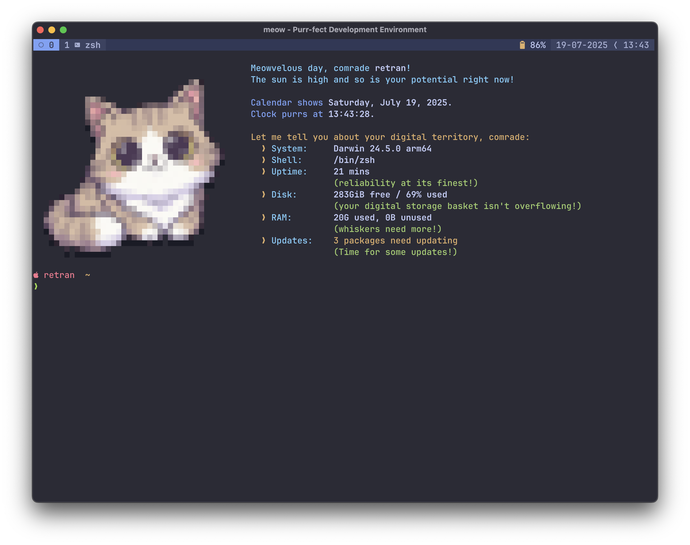
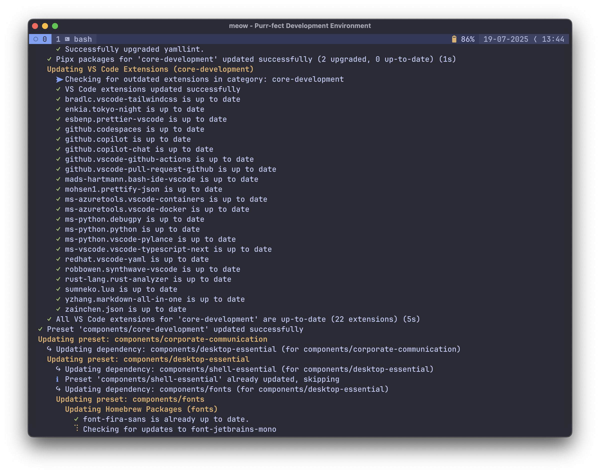
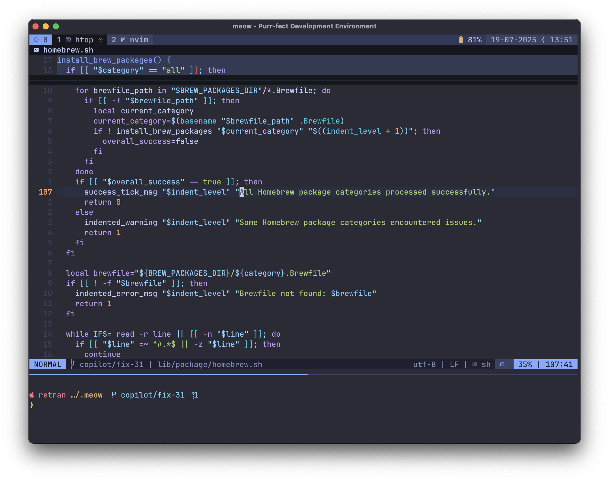

# 🐱 meow

> The purr-fect dotfiles management system that sets up your development
> environment with a single meow.

<div align="center">


</div>

<div align="center">

<br>
<strong>meow - Purr-fect Development Environment</strong>
</div>

`meow` was born from the desire to eliminate the repetitive and time-consuming
task of setting up a development environment from scratch. Instead of manually
installing packages, cloning repositories, and symlinking configuration files
for hours, **`meow` lets you do it all with a single command**.

It uses a powerful **preset system** to deploy a complete, tailored environment,
so you can get straight to coding. Whether you're setting up a new personal
laptop, a corporate workstation, or a disposable development container, `meow`
has a _purr-fect_ setup for you.

---

## Screenshots

<div align="center">





</div>

---

## Core Features

### Dual-Purpose Architecture

**meow** serves two distinct but complementary use cases:

- **🖥️ Desktop Development Environments** (macOS): Complete personal or professional setups with GUI applications, system integrations, and productivity tools
- **🐳 Container Development Environments** (Linux): Optimized development containers with essential CLI tools and language-specific toolchains

### Component-Based Architecture

**Components** are modular building blocks that define specific functionality:
- Package installations for different operating systems
- Configuration file management and symlinks
- Dependency resolution between components
- Lifecycle scripts for setup, environment configuration, and cleanup

**Presets** combine components into complete environment configurations:
- Desktop environments: `personal`, `professional` (macOS)
- Container environments: `litterbox-*` series (Linux)
- Language-specific development setups
- Role-based configurations with appropriate platform targeting

### Cross-Platform Package Management

Automatically detects and uses appropriate package managers:

| Platform           | Package Manager                          |
| ------------------ | ---------------------------------------- |
| **macOS**          | Homebrew, mas (Mac App Store)            |
| **Ubuntu/Debian**  | apt                                      |
| **Alpine Linux**   | apk                                      |
| **Arch Linux**     | pacman                                   |
| **Cross-platform** | npm, pipx, cargo, VS Code extensions    |

### Symlink Management

- Backup existing configurations before creating symlinks
- Restore functionality for rollback scenarios
- Support for both simple files and directory structures

---

## Prerequisites

### Required

| Requirement  | Supported                                 |
| ------------ | ----------------------------------------- |
| **OS**       | macOS · Alpine · Debian/Ubuntu · Arch     |
| **Shell**    | Bash ≥ 3.2                                |
| **Internet** | Required for downloading packages         |
| **Git**      | For repository management and updates     |

> **Bash compatibility:** `meow` works with the default Bash 3.2 that ships with
> macOS, avoiding the chicken-and-egg problem of needing a newer shell to
> install a newer shell.

---

## Getting Started

### Quick Installation

**Option A: Using git (recommended)**

```bash
git clone https://github.com/retran/meow.git ~/.meow
cd ~/.meow
```

**Option B: Using curl**

```bash
curl -L https://github.com/retran/meow/archive/refs/heads/dev.tar.gz | tar xz
mv meow-dev ~/.meow
cd ~/.meow
```

### Configure Personal Settings

Before installation, configure your git, secrets, and meow settings:

```bash
# Configure git settings
cp private/git/.gitconfig.example private/git/.gitconfig
# Edit private/git/.gitconfig with your name and email

# Configure secrets
cp private/secrets/.secrets.example private/secrets/.secrets
# Edit private/secrets/.secrets with your API keys and tokens

# Configure meow settings
cp private/meow/.meowrc.example private/meow/.meowrc
# Edit private/meow/.meowrc with your preferences
```

These files are gitignored and contain your personal information.

### Install a Preset

```bash
# Personal development environment
./bin/meowctl install personal

# Professional environment
./bin/meowctl install professional

# Minimal container setup
./bin/meowctl install litterbox-essential

# Language-specific container environments
./bin/meowctl install litterbox-go
./bin/meowctl install litterbox-rust
./bin/meowctl install litterbox-python
```

### Keep Updated

```bash
cd ~/.meow
./bin/meowctl update --pull
```

---

## Configuration

### Meow Configuration (.meowrc)

The `.meowrc` file allows you to customize meow's behavior:

```bash
# Enable/disable GitHub Copilot integration
export MEOW_ENABLE_COPILOT="false"

# Enable/disable Mac App Store (mas) package management
export MEOW_ENABLE_MAS="true"
```

Configuration options:

- **MEOW_ENABLE_COPILOT** - Controls GitHub Copilot integration in supported components
- **MEOW_ENABLE_MAS** - Controls whether Mac App Store packages are installed/managed

---

### Available Presets

### Desktop Environments (macOS)

- **personal** - Complete development environment with entertainment, social, gaming packages, and development tools. Includes desktop apps, browsers, and full productivity suite
- **professional** - Business-focused environment with corporate communication tools (Slack, Zoom), excluding entertainment software

### Container-Optimized Environments (Linux)

Lightweight development containers optimized for specific use cases. All container presets automatically include essential shell tools:

- **litterbox-essential** - Minimal base with core shell utilities and development tools
- **litterbox-go** - Go development environment
- **litterbox-rust** - Rust development environment  
- **litterbox-python** - Python development environment
- **litterbox-dotnet** - .NET development environment
- **litterbox-fullstack** - Complete full-stack development environment

### Container Testing Environment (Linux)

- **personal-linux** - Linux-compatible version of personal preset with CLI tools for testing and development containers

---

## Available Components

### 🏗️ Foundation Infrastructure

- **shell-foundation** - Essential shell environment with git, Node.js, file navigation tools, system monitoring utilities, and terminal enhancement (zsh plugins, starship prompt)
- **neovim** - Modern text editor with essential plugins and configurations
- **core-development** - Cross-language development tools (go-task, yamllint, httpie)

### 🖥️ Desktop Environment (macOS)

- **desktop-core** - Core system utilities and desktop management (Raycast, mas, AppCleaner)
- **desktop-utilities** - File management and screen recording tools (Keka archiver, Kap screen recorder)
- **browsers** - Web browsers and related tools (Google Chrome)
- **terminal-apps** - Terminal emulator applications with configurations (Alacritty)
- **fonts** - Programming and development fonts (JetBrains Mono, Nerd Fonts)
- **tmux** - Terminal multiplexer for advanced session management (macOS only)

### 🔐 Security & Communication

- **password-management** - Bitwarden desktop application (macOS only)
- **password-management-cli** - Bitwarden command-line interface (cross-platform)
- **business-communication** - Professional messaging tools (Slack, Zoom)
- **personal-communication** - Personal messaging applications (Discord, Telegram, WhatsApp)

### ⚒️ Development Tools

- **visual-studio-code** - VS Code IDE with essential extensions (GitHub Copilot, themes, containers)
- **shell-development** - Shell scripting tools, linting, and language server support
- **markdown** - Markdown editing and preview tools
- **meowvim** - Custom Neovim configuration from GitHub repository

### 🚀 Language-Specific Development

- **go-development** - Go toolchain, debugger, and language servers
- **rust-development** - Rust toolchain and cargo tools
- **python-development** - Python, pip, poetry, and development utilities
- **js-development** - Node.js, npm, and JavaScript tools
- **react-development** - React-specific tools and VS Code extensions
- **dotnet-development** - .NET SDK and development environment
- **kotlin-development-cli** - Kotlin compiler and JVM tools (cross-platform, standardized temurin JVM)
- **kotlin-development** - IntelliJ IDEA IDE for Kotlin development (macOS only)
- **lua-development** - Lua interpreter and development tools
- **web-development** - Web development stack with CSS frameworks and build tools

### 🎯 Productivity & Media

- **productivity** - Task management and productivity applications (Linear, Notion, DrawIO)
- **media** - Media creation tools (OBS Studio)
- **gaming** - Gaming platforms and entertainment (Steam, GeForce Now)
- **time-tracking-cli** - Toggl CLI tools with configuration (cross-platform)
- **time-tracking** - Toggl Track desktop application (macOS only)

### 🎮 Specialized Applications

- **game-development** - Game creation tools including 3D modeling and engine support

### 🐳 Container-Specific

- **docker-cli** - Docker command-line interface for Linux container environments
- **docker-desktop** - OrbStack desktop application for lightweight Docker and Linux VMs (macOS)

### 🔧 Optional Advanced Components

These components provide specialized functionality and must be installed separately using `meowctl component install <component-name>`:

- **adaptive-keyboard-layouts** - Dynamic keyboard layout switching for different connected keyboards
- **meowvim-keyboard-layouts** - Neovim mode-aware keyboard layout switching
- **hammerspoon** - macOS automation and window management framework

---

## Architecture

`meow` uses a three-layer architecture designed for both desktop and container environments:

### 1. Presets Layer

High-level environment configurations optimized for specific use cases:

- **Desktop presets** (macOS): Handle GUI applications, system integrations, and platform-specific tools
- **Container presets** (Linux): Optimized for development containers with essential CLI tools
- Define complete workflows and use cases
- Manage component dependencies automatically

### 2. Components Layer

Modular building blocks with platform-aware implementations:

- Self-contained package and configuration definitions
- Cross-platform support with platform-specific optimizations  
- Dependency declarations between components
- Lifecycle scripts for setup and management

### 3. Package Layer

Platform-specific implementation details:

- Package manager lists (Homebrew, apt, apk, pacman, npm, etc.)
- Configuration files and symlink definitions
- VS Code extensions and language-specific tools

### Dependency Resolution

**Automatic Shell Foundation**: All development environments automatically include `shell-foundation` through the dependency system, ensuring essential shell tools are always installed first.

```plain
User: ./bin/meowctl install personal                    # Desktop environment
    ↓
Preset resolves components: neovim, desktop-core, visual-studio-code, business-communication...
    ↓
Dependencies calculated: shell-foundation → fonts → desktop-core → neovim → visual-studio-code → browsers...
    ↓
Platform-specific packages installed with macOS optimizations (shell tools first, then desktop apps)
    ↓
GUI configurations symlinked and system preferences applied

User: ./bin/meowctl install litterbox-go               # Container environment  
    ↓
Preset resolves components: neovim, core-development, go-development, docker-cli
    ↓  
Dependencies calculated: shell-foundation → neovim → core-development → go-development
    ↓
Linux-specific packages installed with container optimizations (shell tools only)
    ↓
CLI configurations symlinked and development tools configured
```

---

## Creating Custom Components

### Component Structure

```plain
components/my-component/
├── component.yaml          # Metadata and dependencies
├── packages/               # Platform-specific package lists
│   ├── homebrew.list      # macOS (Homebrew)
│   ├── apt.list           # Debian/Ubuntu
│   ├── apk.list           # Alpine Linux
│   ├── pacman.list        # Arch Linux
│   ├── npm.list           # Node.js packages
│   ├── pipx.list          # Python applications
│   └── vscode.list        # VS Code extensions
├── config/                # Configuration file templates
├── symlinks/              # Symlink configuration files
└── scripts/               # Lifecycle scripts
    ├── setup.sh          # One-time setup
    ├── env.sh            # Environment variables
    ├── init.sh           # Shell initialization
    └── cleanup.sh        # Uninstall cleanup
```

### Component Definition

```yaml
# components/my-component/component.yaml
description: "Brief description of functionality"

# Optional platform restrictions
platforms:
  - macos
  - linux

# Component dependencies
depends_on:
  - shell-foundation
  - core-development

# Optional: External git repository
repository:
  url: "https://github.com/username/repo"
  branch: "main"
```

### Package Lists

Create platform-specific package lists in the `packages/` directory:

```bash
# packages/homebrew.list
my-development-tool
another-utility

# packages/apt.list
my-development-tool
another-utility

# packages/vscode.list
publisher.extension-name
```

### Symlink Configuration

Define symlinks in YAML files within the `symlinks/` directory:

```yaml
# symlinks/config.yaml
- source: "$MEOW/components/my-component/config/tool-config"
  target: "$HOME/.config/my-tool"

- source: "$MEOW/private/secrets/.env"
  target: "$HOME/.env"
```

### Lifecycle Scripts

Components support four types of lifecycle scripts:

- **setup.sh** - Runs once during initial installation
- **env.sh** - Exports environment variables (sourced by shell)
- **init.sh** - Runs on every shell initialization
- **cleanup.sh** - Runs during component uninstallation

Example setup script:

```bash
#!/usr/bin/env bash
COMPONENT_NAME="$1"
MEOW="$2"

source "${MEOW}/lib/core/ui.sh"

ui_step_header "Setting up ${COMPONENT_NAME}"

# Custom setup logic here
```

### Hammerspoon Plugin Support

Components can provide Hammerspoon plugins by including a `config/init.lua` file. The main Hammerspoon configuration automatically loads plugins from installed components:

```lua
-- components/my-component/config/init.lua
local plugin = {}

function plugin.init()
  -- Plugin initialization code
  print("My plugin loaded")
end

function plugin.cleanup()
  -- Plugin cleanup code
end

return plugin
```

---

## Creating Custom Presets

Presets combine components into complete environment configurations:

```yaml
# presets/my-preset/preset.yaml
description: "Custom development environment"

# Optional platform restrictions
platforms:
  - macos
  - linux

# Required components
required:
  - shell-foundation
  - file-navigation  
  - core-development
  - my-custom-component
```

Create the preset directory under `presets/` and the system handles dependency resolution automatically.

---

## Command Line Interface

### Main Commands

```bash
# List available presets
./bin/meowctl list

# Install a preset
./bin/meowctl install <PRESET_NAME>

# Update all installed components
./bin/meowctl update

# Update with git pull first
./bin/meowctl update --pull

# Update specific preset
./bin/meowctl update <PRESET_NAME>

# Uninstall preset
./bin/meowctl uninstall <PRESET_NAME>

# Uninstall all presets
./bin/meowctl uninstall all
```

### Component Management

```bash
# List all components
./bin/meowctl component list

# Install specific component
./bin/meowctl component install <COMPONENT_NAME>

# Update component
./bin/meowctl component update <COMPONENT_NAME>

# Uninstall component
./bin/meowctl component uninstall <COMPONENT_NAME>
```

### Backup Management

```bash
# List available backups
./bin/meowctl backup list

# Restore from backup
./bin/meowctl backup restore <BACKUP_FILE>
```

### Global Options

- `--verbose, -v` - Show detailed output
- `--dry-run` - Preview changes without making them
- `--help, -h` - Show help

---

## Project Structure

The `meow` codebase is organized into logical modules:

### Core Libraries (`lib/`)

- **`lib/core/`** - Fundamental utilities (bash helpers, UI functions, dry-run mode)
- **`lib/env/`** - Environment detection and configuration
- **`lib/package/`** - Package manager abstractions and platform detection
- **`lib/components/`** - Component lifecycle management and dependency resolution
- **`lib/presets/`** - Preset parsing and installation orchestration
- **`lib/symlinks/`** - Dotfile symlinking with backup and restore capabilities
- **`lib/motd/`** - Message of the day system for installation feedback

### Command Interface

- **`bin/meowctl`** - Unified command-line interface with subcommands for all operations

### Configuration System

- **`components/`** - Modular component definitions with platform-specific packages
- **`presets/`** - Environment templates that combine components
- **`private/`** - User-specific configuration (git settings, API keys, meow settings)

---

## Contributing

Contributions are welcome! Here's how you can help:

### Ways to Contribute

- Report bugs and issues
- Suggest new features or presets
- Improve documentation
- Submit pull requests
- Add new components
- Enhance platform support

### Getting Help

1. Check the [Issues](https://github.com/retran/meow/issues) page
2. Review component definitions in `components/`
3. Examine preset configurations in `presets/`

---

## License

Licensed under the MIT License. See [`LICENSE`](LICENSE) for details.

---

## Acknowledgments

`meow` builds on excellent open-source projects including:

- [Homebrew](https://brew.sh/) • [Git](https://git-scm.com/) • [GitHub CLI](https://cli.github.com/)
- [tmux](https://github.com/tmux/tmux) • [Starship](https://starship.rs/) • [Neovim](https://neovim.io/)
- [Visual Studio Code](https://code.visualstudio.com/) • [fzf](https://github.com/junegunn/fzf)
- [ripgrep](https://github.com/BurntSushi/ripgrep) • [zoxide](https://github.com/ajeetdsouza/zoxide)
- [Go](https://golang.org/) • [Node.js](https://nodejs.org/) • [Rust](https://www.rust-lang.org/)
- [Hammerspoon](https://www.hammerspoon.org/) • [Nerd Fonts](https://www.nerdfonts.com/)

---

### Author

`meow` is developed by Andrew Vasilyev with help from GitHub Copilot and feline assistants Sonya Blade, Mila, and Marcus Fenix.

---

<div align="center">

**Happy coding with `project meow`! 🐱**

Made with ❤️ by Andrew Vasilyev and feline assistants

[Report Bug](https://github.com/retran/meow/issues) ·
[Request Feature](https://github.com/retran/meow/issues) ·
[Contribute](https://github.com/retran/meow/pulls)

</div>