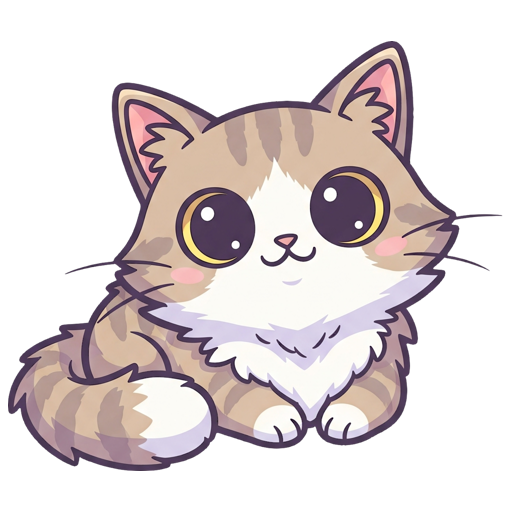

# 🐱 meow

> The purr-fect dotfiles management system that sets up your development environment with a single meow.

<div align="center">


</div>

<div align="center">

<br>
<strong>meow - Purr-fect Development Environment</strong>
</div>

A comprehensive dotfiles management system that automates the tedious task of configuring a new machine by applying predefined setups called "presets." Instead of spending hours installing packages and tweaking configs, just pick a preset and you're ready to code. Part of the meow ecosystem, including [MeowVim](https://github.com/retran/meowvim) for Neovim configuration.

## 🖼️ Screenshots

<div align="center">

### Development Environment


</div>

## 📋 Table of Contents

- [🖼️ Screenshots](#️-screenshots)
- [🌟 Key Features](#-key-features)
- [✨ Features](#-features)
- [📋 Prerequisites](#-prerequisites)
- [🚀 Installation](#-installation)
- [⚡ Quick Start](#-quick-start)
- [📖 Usage](#-usage)
- [🧩 Components](#-components)
- [📚 Documentation](#-documentation)
- [🔧 Troubleshooting](#-troubleshooting)
- [🤝 Contributing](#-contributing)
- [📄 License](#-license)
- [🙏 Acknowledgments](#-acknowledgments)

## 🌟 Key Features

- **🎯 Two Main Presets**: personal and corporate
- **📦 Multi-Package Manager**: Homebrew, pipx, npm, Go packages, and Mac App Store
- **🔧 Pre-configured Environments**: Go, .NET, Kotlin, Godot, JavaScript, React, and more
- **🐾 Cat-themed Customizations**: Terminal greetings and personalized touches
- **🔗 Automatic Dotfile Linking**: Seamless configuration deployment
- **🧩 Mix and Match Components**: Custom setups for specific needs
- **⚡ One-Command Setup**: Single script installation and updates
- **🌐 macOS Support**: Designed specifically for macOS systems

## ✨ Features

meow provides a comprehensive development environment setup with these key capabilities:

### 🎯 Preset System
- **Two Main Presets**: Complete development configurations for different use cases
- **Personal Preset**: Full development setup with all tools and customizations
- **Corporate Preset**: Work-focused Go development environment

### 📦 Package Management
- **Homebrew**: Native macOS applications and system tools
- **npm**: JavaScript/Node.js packages and development tools
- **pipx**: Python command-line applications in isolated environments
- **Go Packages**: Development tools via `go install`
- **VS Code Extensions**: Enhanced development experience
- **Mac App Store**: Commercial applications and utilities

### 🔧 Development Environments
- **Go Development**: Complete environment with language server, debugger, and tools
- **JavaScript/TypeScript**: Node.js tools, language servers, and formatters
- **Kotlin Development**: Kotlin environment and tooling
- **.NET Development**: .NET tools and SDK
- **React Development**: React-specific tooling extending JavaScript
- **Web Development**: CSS frameworks, build tools, and HTTP testing
- **Game Development**: Tools and engines including Godot
- **Markdown**: Technical writing with linting and presentation tools

### 🐾 User Experience
- **Cat-themed Branding**: Project meow ASCII art and terminal greetings
- **Automatic Configuration**: Seamless dotfile linking and setup
- **One-Command Installation**: Simple script-based deployment
- **Modular Components**: Mix and match for custom setups
- **Dependency Resolution**: Automatic component dependency management

## 📋 Prerequisites

Before installing meow, ensure you have the following:

### Required
- **Operating System**: macOS
- **Shell**: Bash or Zsh
- **Git**: For cloning the repository and version control integration
- **Internet Connection**: For downloading packages and tools

### Automatically Installed
- **Homebrew**: Package manager for macOS (installed automatically if missing)
- **Terminal**: Ghostty terminal is included in the setup

## 🚀 Installation

### Option 1: Fresh Installation

For a complete setup with all submodules (including MeowVim):

```bash
# Clone with submodules
git clone --recurse-submodules https://github.com/retran/meow.git ~/.meow
cd ~/.meow

# Install your preferred preset
./bin/install.sh PRESET_NAME
```

### Option 2: Existing Repository

If you've already cloned without submodules:

```bash
# Navigate to your existing clone
cd ~/.meow

# Initialize and update submodules
git submodule init
git submodule update

# Install your preferred preset
./bin/install.sh PRESET_NAME
```

### Available Presets

**🏠 Personal** - Complete development setup with all tools and customizations
```bash
./bin/install.sh personal
```

**🏢 Corporate** - Work-focused Go development environment
```bash
./bin/install.sh corporate
```

## ⚡ Quick Start

After installation, follow these steps to get started:

### 1. Choose Your Preset
Based on your needs:
- **New personal machine**: Use `personal` preset
- **Work environment**: Use `corporate` preset

### 2. One-Command Setup
```bash
# New personal machine
git clone --recurse-submodules https://github.com/retran/meow.git ~/.meow && cd ~/.meow && ./bin/install.sh personal

# Corporate environment
git clone --recurse-submodules https://github.com/retran/meow.git ~/.meow && cd ~/.meow && ./bin/install.sh corporate
```

### 3. Enjoy Your Setup
After installation:
- Your shell will display the new project meow ASCII art
- All development tools will be available
- Configurations are automatically linked

### 4. Keep It Updated
```bash
# Update all packages
./bin/update.sh

# Update specific preset
./bin/update.sh corporate
```

## 🧩 Components

meow uses a modular component system where each component can depend on others, creating a layered architecture for development environments:

### Foundation Components

- **🐚 shell-essential** - Essential shell tools component (Git, Tmux, Starship, Neovim)
- **🖥️ desktop-essential** - GUI foundation component for macOS desktop applications
- **🛠️ core-development** - Core development tools shared across all programming environments (depends on shell-essential)
- **🎨 fonts** - Essential programming and design fonts

### Programming Languages

- **🐹 go-development** - Complete Go development environment with language server, debugger, linters, and build tools
- **⚡ javascript** - JavaScript/TypeScript development with Node.js tools, language servers, and formatters
- **🗾 kotlin-development** - Kotlin development environment and tools
- **🦄 dotnet-development** - .NET development tools and SDK

### Frontend & Web Development

- **⚛️ react** - React development framework extending JavaScript with React-specific tooling
- **🌐 web** - Advanced web development with CSS frameworks, build tools, deployment utilities, and HTTP testing (extends React)

### Specialized Development

- **🎮 game-development** - Game development tools and engines including Godot
- **📝 markdown** - Technical writing with linting, spell checking, presentation tools, and terminal rendering

### Communication & Productivity

- **💼 corporate-communication** - Professional communication tools for work environments
- **👥 personal-communication** - Personal messaging and social applications
- **📋 productivity** - Foundation for desktop productivity environment

### Entertainment & Media

- **🎮 gaming** - Gaming platforms and applications
- **🎨 media** - Media editing and graphics tools

### Package Manager Support

Components support multiple package managers depending on their needs:
- **Homebrew**: Native macOS applications and system tools
- **npm**: JavaScript/Node.js packages and development tools
- **pipx**: Python command-line applications installed in isolation
- **Go packages**: Go development tools installed via `go install`
- **VS Code**: Editor extensions for enhanced development experience
- **Mac App Store**: Commercial applications and utilities

Components automatically resolve dependencies - for example, `react` includes `javascript`, which includes `core-development`, which includes `shell-essential`.

## 📖 Usage

### Updating Your System

```bash
# Update all packages for all presets
./bin/update.sh

# Update packages for a specific preset
./bin/update.sh corporate
```

### Getting Help

```bash
# Get help for the install script
./bin/install.sh --help

# Get help for the update script
./bin/update.sh --help
```

### Common Workflows

**New personal machine:**
```bash
git clone --recurse-submodules https://github.com/retran/meow.git ~/.meow && cd ~/.meow && ./bin/install.sh personal
```

**Work environment setup:**
```bash
git clone --recurse-submodules https://github.com/retran/meow.git ~/.meow && cd ~/.meow && ./bin/install.sh corporate
```

## 🔧 Troubleshooting

### Common Issues

#### Installation Fails
```bash
# Check if Git is installed
git --version

# Ensure submodules are properly initialized
cd ~/.meow
git submodule init
git submodule update --recursive

# Try installing again
./bin/install.sh PRESET_NAME
```

#### Package Manager Issues
```bash
# For Homebrew issues on macOS
/bin/bash -c "$(curl -fsSL https://raw.githubusercontent.com/Homebrew/install/HEAD/install.sh)"

# For npm issues
npm cache clean --force
npm install -g npm@latest

# For pipx issues
python -m pip install --upgrade pipx
pipx ensurepath
```

#### Neovim Configuration Not Working
```bash
# Check if Neovim submodule is properly initialized
cd ~/.meow
git submodule status

# If not initialized, run:
git submodule init
git submodule update

# Check Neovim installation
nvim --version
```

#### ASCII Art Not Displaying
1. **Terminal Support**: Ensure your terminal supports true color
2. **Font Issues**: Install a Nerd Font for proper icon display
3. **Color Settings**: Check your terminal's color settings

#### Permission Issues
```bash
# Fix ownership issues
sudo chown -R $(whoami) ~/.meow

# Fix script permissions
chmod +x ~/.meow/bin/*.sh
```

### Getting Help
- Check the [issues page](https://github.com/retran/meow/issues)
- Review preset configurations in `presets/` directory
- Examine component definitions in `presets/components/`
- Check package definitions in `packages/` directory

## 🤝 Contributing

Contributions are welcome to help improve meow! Here's how you can help:

### Ways to Contribute
- 🐛 Report bugs
- 💡 Suggest new features or presets
- 📝 Improve documentation
- 🔧 Submit code improvements
- 🎨 Enhance configurations
- 📦 Add new package integrations

### Development Setup
```bash
# Fork the repository
git clone https://github.com/YOUR-USERNAME/meow.git ~/.meow-dev
cd ~/.meow-dev

# Initialize submodules
git submodule init
git submodule update --recursive

# Create a feature branch
git checkout -b feature/new-feature

# Make your changes and test thoroughly with different presets
./bin/install.sh shell-essential  # Test basic functionality
./bin/install.sh personal         # Test full installation

# Commit your changes
git commit -m "Add new feature"

# Push to your fork
git push origin feature/new-feature

# Create a Pull Request
```

### Adding New Components
1. **Create component files** in `presets/components/`
2. **Define packages** in `packages/` for each package manager
3. **Add configurations** in `config/` if needed
4. **Update presets** to include your component
5. **Test thoroughly** with different presets
6. **Update documentation** as needed

### Code Style
- Follow existing code patterns and structure
- Use meaningful variable names and comments
- Keep functions focused and small
- Test your changes with multiple presets
- Ensure backward compatibility

### Pull Request Guidelines
1. Fork the repository
2. Create a feature branch from `main`
3. Make your changes with clear commit messages
4. Test thoroughly with different presets
5. Update documentation if needed
6. Submit a Pull Request with a clear description

## 📄 License

This project is licensed under the MIT License. See the [LICENSE](LICENSE) file for details.

## 🙏 Acknowledgments

meow builds on the excellent work of the open-source community and various development tools.

### Core Tools
- [Homebrew](https://brew.sh/) - The missing package manager for macOS
- [Zsh](https://zsh.sourceforge.io/) - Extended shell with advanced features
- [Tmux](https://github.com/tmux/tmux) - Terminal multiplexer
- [Git](https://git-scm.com/) - Version control system

### Development Environments
- [Go](https://golang.org/) - Programming language and tools
- [Node.js](https://nodejs.org/) - JavaScript runtime
- [Python](https://python.org/) - Programming language
- [.NET](https://dotnet.microsoft.com/) - Development platform

### Package Managers
- [npm](https://npmjs.com/) - Node.js package manager
- [pipx](https://pipxproject.github.io/pipx/) - Python application installer
- [VS Code](https://code.visualstudio.com/) - Code editor platform

### Author
meow is developed by Andrew Vasilyev with help from feline assistants Sonya, Mila, and Marcus Fenix.

---

<div align="center">

**Happy coding with project meow! 🐱**

Made with ❤️ by Andrew Vasilyev and feline assistants

[Report Bug](https://github.com/retran/meow/issues) · [Request Feature](https://github.com/retran/meow/issues) · [Contribute](https://github.com/retran/meow/pulls)

</div>
